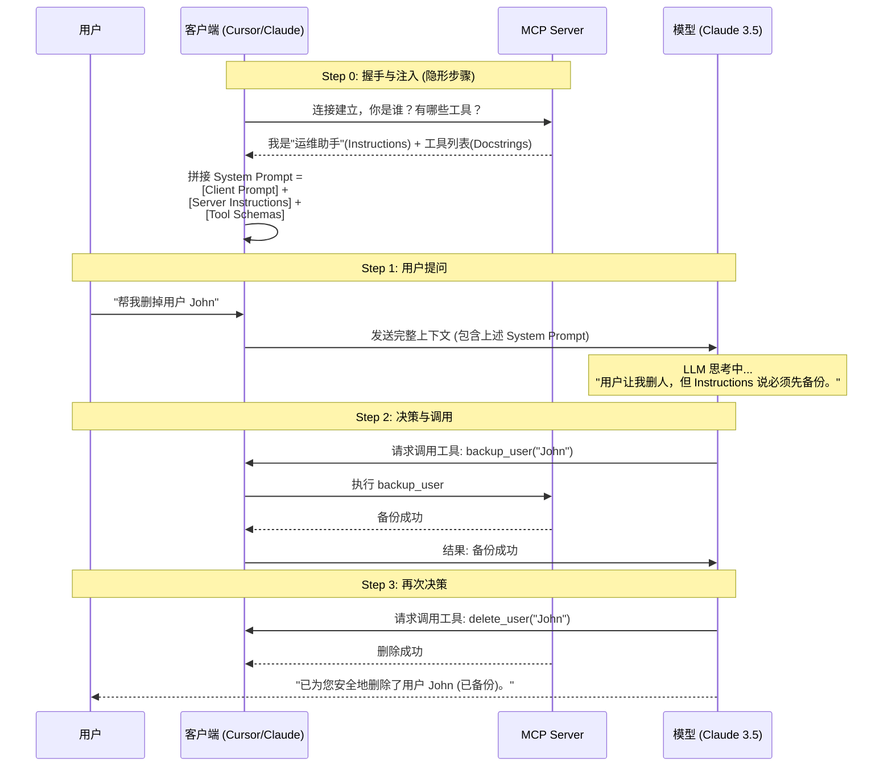

# FastMCP 开发指南：从入门到精通

本文档详细总结了 FastMCP 的核心概念、工作机制以及最佳实践。适用于希望构建高质量 MCP Server 的开发者。

## 1. 什么是 FastMCP？

**FastMCP** 是 Model Context Protocol (MCP) 的一个高级 Python 封装库。

*   **定位**：它是 MCP 领域的 **FastAPI**。
*   **设计哲学**：
    *   **Ergonomic (人体工程学)**：利用 Python 类型提示 (Type Hints) 和装饰器提供极致的开发体验。
    *   **Automatic (自动化)**：自动将 Python 函数签名转换为 MCP 工具定义 (JSON Schema)。
    *   **Fast (快速)**：基于 `uvicorn` 和 `anyio`，支持异步高性能运行。

---

## 2. 核心三支柱：Tool, Resource, Prompt

MCP 协议定义了三种主要的能力原语，FastMCP 对它们进行了完美的封装。

| 类型 | 装饰器 | 核心意图 | 类比 | 典型场景 |
| :--- | :--- | :--- | :--- | :--- |
| **Tool** | `@mcp.tool()` | **执行动作** (Do) | 函数 / API POST | 计算数据、修改数据库、发送消息、重启服务 |
| **Resource** | `@mcp.resource()` | **读取数据** (Read) | 文件 / API GET | 读取配置文件、获取用户资料、查看日志 |
| **Prompt** | `@mcp.prompt()` | **预设指令** (Templating) | 快捷指令 / 模板 | "代码审查"、"生成周报" 等常用对话模板 |

---

## 3. 深入解析：指令与描述 (The "Brain" of MCP)

在开发 MCP Server 时，最容易混淆的是“我应该在哪里告诉 LLM 怎么做？”。这涉及到两个层级：

### 3.1 宏观层级：Instructions (指令)
*   **定义**：在创建 `FastMCP` 实例时传入的 `instructions` 参数。
*   **作用**：**Server 级别的 System Prompt**。
*   **内容**：定义 Server 的“人设”、全局行为准则、安全限制、工具使用的优先顺序。
*   **示例**：*"你是一个专业的运维助手。这是一个生产环境，执行任何删除操作前必须先备份。"*

### 3.2 微观层级：Docstrings (文档字符串)
*   **定义**：Python 函数体内的第一行注释。
*   **作用**：**Tool 级别的说明书**。
*   **内容**：定义单个工具的功能、参数含义、参数单位、返回值描述。
*   **示例**：*"计算 BMI 指数。参数 weight_kg 必须是公斤，height_m 必须是米。"*

### 3.3 交互流程图：System Prompt 是如何生效的？

很多开发者误以为 Tool 的描述是在调用时才给 LLM 的。其实不然，**所有信息都在 Step 0 就注入了**。



### 3.4 深度辨析：Instructions vs Prompts

这是开发者最容易混淆的两个概念。虽然它们看起来都是“给 LLM 的话”，但机制完全不同。

| 特性 | `instructions="..."` (指令) | `@mcp.prompt()` (提示词模板) |
| :--- | :--- | :--- |
| **本质** | **System Prompt (系统级设定)** | **User Message Template (用户消息模板)** |
| **生效方式** | **被动、强制、全局** | **主动、可选、单次** |
| **比喻** | **背景音乐 (BGM)**：一直在后台放，潜移默化影响气氛 | **点歌机**：只有你去点歌（调用），它才会播放 |
| **Cline/Cursor 表现** | 用户不可见，但模型时刻遵守 | 用户在菜单中选择，填入后变成用户提问的一部分 |

**关键结论**：
*   **Instructions** 是为了约束 **AI** 的行为（例如安全规范）。
*   **@mcp.prompt** 是为了节省 **用户** 的打字时间（例如常用提问模板）。

---

## 4. 高级功能

### 4.1 上下文感知 (Context)
工具不仅仅是孤立的函数，它们可以与 MCP 系统的上下文交互。
*   **用法**：在参数中添加 `ctx: Context`。
*   **能力**：
    *   `ctx.info(msg)` / `ctx.error(msg)`: 发送日志到客户端控制台。
    *   `ctx.report_progress(current, total)`: 在客户端显示进度条。
    *   `ctx.request_sampling(prompt)`: "反向"请求 LLM 帮助（Human-in-the-loop）。

### 4.2 返回图片 (Image)
Tool 可以直接返回图片，客户端会直接渲染出来。
*   **用法**：返回 `fastmcp.Image` 对象。

---

## 5. 最佳实践代码示例

以下是一个集大成的示例，展示了所有核心概念的正确用法。

```python
from fastmcp import FastMCP, Context, Image

# ==============================================================================
# 1. 定义 Server 与 宏观指令 (Instructions)
# ==============================================================================
# Instructions 是给 LLM 的全局行为准则，非常重要！
mcp = FastMCP(
    name="DataAssistant",
    instructions="""
    你是一个资深数据分析师助手。
    原则：
    1. 在进行任何复杂计算前，先获取配置确认精度要求。
    2. 如果计算过程很长，请务必报告进度。
    3. 永远优先使用图表（Image）来展示结果。
    """
)

# ==============================================================================
# 2. 定义工具 (Tools) - 微观说明书 (Docstrings)
# ==============================================================================

@mcp.tool()
async def analyze_data(dataset_id: str, ctx: Context) -> str:
    """
    分析指定数据集的统计特征。
    
    Args:
        dataset_id: 数据集的唯一标识符 (UUID格式)。
        ctx: MCP 上下文，用于报告进度。
    """
    # 使用 Context 记录日志
    ctx.info(f"开始分析数据集: {dataset_id}")
    
    # 模拟长耗时操作，报告进度
    for i in range(0, 100, 20):
        await ctx.report_progress(i, 100)
    
    return f"数据集 {dataset_id} 分析完成：均值=42, 方差=1.5"

@mcp.tool()
def generate_chart(data_points: list[float]) -> Image:
    """
    根据数据点生成趋势图。
    
    Args:
        data_points: 一组浮点数列表。
    """
    # 这里通常会用 matplotlib 绘图并转为 bytes
    # 模拟返回一个简单的 PNG 图片数据
    fake_png_data = b"\x89PNG\r\n..." 
    return Image(data=fake_png_data, mime_type="image/png")

# ==============================================================================
# 3. 定义资源 (Resources) - 数据访问
# ==============================================================================

@mcp.resource("config://app/settings")
def get_app_config() -> dict:
    """获取应用程序的全局配置信息。"""
    return {"precision": "high", "max_items": 1000}

# ==============================================================================
# 4. 定义提示词 (Prompts) - 快捷指令模板
# ==============================================================================

@mcp.prompt()
def code_review(code: str) -> list[dict]:
    """生成一个标准的代码审查 Prompt"""
    return [
        {
            "role": "user",
            "content": f"请作为架构师审查以下代码，关注安全性：\n\n{code}"
        }
    ]

if __name__ == "__main__":
    mcp.run()
```

## 6. 常见误区解答

### Q: 我需要手动写一个 Resource 来列出所有 Tool 吗？
**A: 绝对不需要。**
MCP 协议会自动发现所有被 `@mcp.tool` 装饰的函数，生成清单并注入给 LLM。手动维护列表不仅多余，还容易出错。

### Q: Docstring 真的那么重要吗？
**A: 非常重要。**
Docstring 就是 LLM 的“眼睛”。如果你不写 Docstring，或者写得含糊不清（比如参数没写单位），LLM 就只能瞎猜，导致调用失败。把 Docstring 当作是**写给 AI 看的代码逻辑**。

### Q: 如果连接了多个 MCP Server，Instructions 会冲突吗？
**A: 会合并，可能冲突。**
客户端会将所有连接的 Server 的 Instructions **拼接**在一起发给 LLM。
*   **机制**：System Prompt = Cline Prompt + Server A Instructions + Server B Instructions ...
*   **风险**：如果 Server A 说“永远用中文”，Server B 说“永远用英文”，LLM 就会混乱。
*   **建议**：编写 Instructions 时要遵循 **"各扫门前雪"** 原则。不要写全局指令，要限定范围（例如 *"在使用本 Server 的工具进行操作时，请..."*）。
